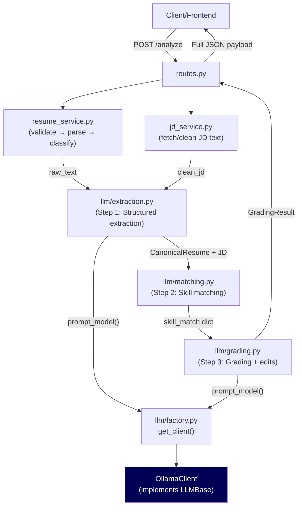

# System Architecture

The Resume Agent uses a Domain-Driven Design (DDD) structure to maintain strict boundaries between input layers, processing engines, and business logic. This ensures traceability and enables safe iteration with the local LLM.

## Module Breakdown (`app/`)

### 1. `domain/`
Pure business logic, custom exceptions, and core data models — independent of FastAPI or any external framework.
- `exceptions.py`: Application-specific errors mapped to clean HTTP status codes.
- `validation.py`: Magic-byte file validation (prevents disguised executables from reaching parsers).
- `classification.py`: Heuristic scoring to reject non-resume documents (cover letters, invoices).
- `resume_models.py`: Pydantic canonical resume schema with VERBATIM/MUTABLE field annotations and tiered hallucination enforcement via `model_validator`. Uses `object.__setattr__` for in-validator mutations to avoid `validate_assignment` recursion.
- `jd_models.py`: Pydantic schema for structured JD extraction (`core_requirements`, `preferred_qualifications`, `tech_stack`).
- `jd_parsing.py`: 4-layer JD extraction pipeline (JSON-LD → Trafilatura recall → BS4 heading walker → merge/dedupe). Raises `ScrapingBlockedException` when content cannot be extracted.

### 2. `parsers/`
Decoupled text ingestion.
- `pdf_parser.py` / `docx_parser.py`: Thin wrappers around `pdfplumber` and `python-docx`.
- `registry.py`: Dynamic switchboard — services request a parser by file type, no if/else chains in calling code.

### 3. `services/`
Orchestration layer bridging domain logic and the API.
- `resume_service.py`: Chains validation → parser registry → classification.
- `jd_service.py`: Handles URL fetching (SSRF protection, 5MB memory-safe streaming) and raw text cleanup. Raises `ScrapingBlockedException` on blocked/timed-out/JS-only pages, returning HTTP 422 with a user-facing message.

### 4. `services/llm/`
Modular LLM pipeline. Designed so swapping providers requires adding one file and one line — no changes to extraction or grading logic.

#### Provider abstraction
- `base.py`: `LLMBase` ABC defining `prompt_model(system, user, think=False) → str`. All providers implement this interface.
- `ollama_client.py`: `OllamaClient(LLMBase)`. Handles Ollama-specific payload shape, retries, timeouts, `<think>` block stripping, and structured logging. Selects `LLM_EXTRACTION_MODEL` or `LLM_GRADING_MODEL` based on the `think` flag.
- `factory.py`: `_REGISTRY` maps provider name strings to classes. `get_client()` reads `LLM_PROVIDER` from config and returns the right instance. Adding a provider = one new file + one `_REGISTRY` entry.

#### Pipeline steps
- `extraction.py`: Step 1 — fast structured extraction (`think=False`, uses `LLM_EXTRACTION_MODEL`). Injects `raw_text` after LLM parse (not in prompt) to save ~1000 tokens per call.
- `matching.py`: Step 2 — deterministic, zero-LLM skill matching. Three layers: exact match → fuzzy match (`rapidfuzz`, threshold 85) → (semantic embeddings, planned). Prose requirements (>5 words) bypass string matching and go directly to the grader.
- `grading.py`: Step 3 — deep reasoning (`think=True`, uses `LLM_GRADING_MODEL`). Post-processes traceability tags: downgrades unsupported "source text" claims and catches suggestions naming skills already present in the resume.
- `prompts.py`: All prompt strings in one file. Prompt changes never touch pipeline logic.
- `skill_aliases.py`: Alias map + `expand_skill()` for compound normalization (`"AWS (EC2, S3)"` → `"aws"`, `"JavaScript/TypeScript"` → `["javascript", "typescript"]`).
- `cache.py`: Two-layer cache — in-memory L1 (zero-latency, lost on restart) backed by `shelve` L2 (persists to `data/llm_cache`, 7-day TTL). Each pipeline step caches independently by SHA256 of its inputs.

### 5. `config.py`
All environment-overridable settings in one place:
- `LLM_PROVIDER` — which client class to use (default `"ollama"`)
- `LLM_EXTRACTION_MODEL` — fast model for extraction (default `qwen3:4b`)
- `LLM_GRADING_MODEL` — reasoning model for grading (default `qwen3:8b`)
- `CACHE_PATH`, `CACHE_TTL_SECONDS` — persistent cache location and TTL
- `OLLAMA_BASE_URL` — remote Ollama server override for Docker/cloud deployments

### 6. `routes.py`
Thin FastAPI transport layer. Fields requests, delegates to services, catches domain exceptions, formats REST responses. No business logic lives here.

---

## Data Flow

---

## Hallucination Prevention

Every LLM output is validated at multiple layers:

| Layer | Mechanism |
|---|---|
| Extraction | VERBATIM validator strips invented skills, companies, metrics not found in `raw_text` |
| Skill matching | Deterministic set operations — no LLM involvement, no hallucination risk |
| Grading prompt | Matched skills explicitly labeled "do NOT list as gaps" |
| Traceability enforcement | Post-processing re-tags edits that name skills already in the resume |
| Traceability tags | Every edit suggestion must carry one of 5 tags (see below) |

**Traceability tags:**
1. `"supported by source text"` — evidence literally in resume
2. `"formatting improvement"` — structure/presentation only
3. `"generic strengthening suggestion"` — valid advice, not resume-specific
4. `"missing but unverifiable, ask user to supply"` — real gap, user must confirm
5. `"already present in resume — rephrase for emphasis"` — auto-applied by post-processor when suggestion names skills already found in `raw_text`

---

## Roadmap

### Semantic similarity matching (v2)
Fuzzy matching (current) catches string variants. Semantic embeddings catch concept-level matches (`"cloud infrastructure"` ≈ `"AWS/GCP/Azure"`). Plan: `nomic-embed-text` via Ollama (no new dependency — already running).

### PDF generation (v2)
`services/pdf_generator.py` producing an ATS-optimized PDF from the Canonical JSON + approved edits. Stateless by design.

### Pipeline progress
1. Upload (done)
2. Parse (done)
3. Normalize (done)
4. JD Resolution (done)
5. Grade (done)
6. Recommend (done)
7. Human Review (pending frontend)
8. Regenerate (pending v2)
