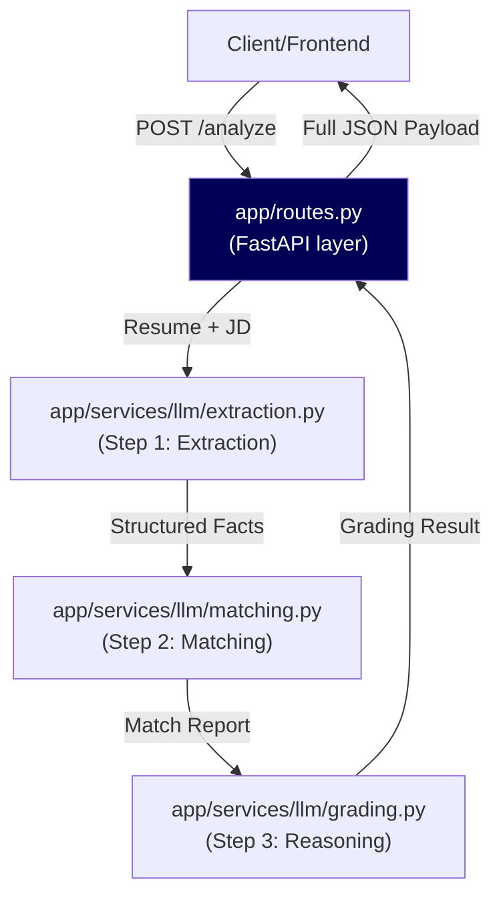

# System Architecture

The Resume Agent utilizes a Domain-Driven Design (DDD) structure to maintain strict boundaries between its input layers, processing engines, and business logic. This ensures traceabilty and enables safe iteration with the local LLM.

## Module Breakdown (`app/`)

### 1. `domain/`
Hosts pure business logic, custom exceptions, and core data models independent of external libraries or frameworks (like FastAPI). 
- `exceptions.py`: Application-specific errors ensuring our API routing can return clean HTTP status codes mapped to exact logic failures.
- `validation.py`: File validation via magic-bytes (preventing disguised executables from crashing the parsers).
- `classification.py`: Pure heuristic algorithms (e.g., scoring text tokens) to reject letters of recommendation or cover letters from being processed as resumes.
- `resume_models.py`: Pydantic canonical resume schema with VERBATIM/MUTABLE field annotations to prevent LLM hallucination.
- `jd_models.py`: Pydantic schema for structured Job Description extraction (core requirements, tech stack, etc.).
- `jd_parsing.py`: 4-layer JD extraction pipeline (JSON-LD -> Trafilatura recall -> BS4 heading walker -> merge/dedupe).

### 2. `parsers/`
Handles text extraction decoupling.
- `pdf_parser.py` & `docx_parser.py`: Wrap respective third-party libraries (`pdfplumber`, `python-docx`).
- `registry.py`: A dynamic switchboard used by the services layer to fetch the right extractor cleanly, reducing if/else spaghetti.

### 3. `services/`
The orchestrator.
- `resume_service.py`: Contains `process_resume_upload`, chaining validation, parser registry, and classification sequentially.
- `jd_service.py`: Contains `process_job_description`, handling URL fetching with SSRF protection, memory-safe streaming, and raw text cleanup.

### 4. `services/llm/` (New)
A modular package for local LLM orchestration using Ollama.
- `extraction.py`: Fast structured extraction using `think=False`.
- `matching.py`: Deterministic skill matching logic.
- `grading.py`: Nuanced career analysis using `think=True` reasoning.
- `prompts.py`: Centralized prompt storage for rapid iteration.

### 5. `routes.py`
The FastAPI transport layer. Merely fields the request, offloads it to `services/`, and catches any domain exceptions to format standard REST responses.
- `/upload-resume/`: Resume file upload and parsing.
- `/process-jd/`: JD text or URL processing.
- `/analyze/`: Unified endpoint accepting both resume + JD in one request. Orchestrates the 3-step LLM pipeline.

---

## Data Flow Diagram

---

## Roadmap & Future Enhancements

### 1. Semantic Similarity Matching (v2)
Currently, skill matching relies on a deterministic `SKILL_ALIASES` map. While effective for tech keywords, it can miss semantic synonyms.
- **Planned**: Replace the alias map with `sentence-transformers` embeddings.
- **Goal**: Compute cosine similarity between vectors to catch matches like "cross-functional leadership" ≈ "led distributed teams" without manual rules.

### 2. PDF Generation (v2)
- **Goal**: Implement `services/pdf_generator.py` to produce a finalized, ATS-optimized PDF incorporating the "Top 3 Edits."

### 3. Pipeline Progress
1. **Upload** (Done)
2. **Parse** (Done)
3. **Normalize** (Done)
4. **JD Resolution** (Done)
5. **Grade** (Done)
6. **Recommend** (Done)
7. **Human Review** (Pending Frontend)
8. **Regenerate** (Pending v2)
