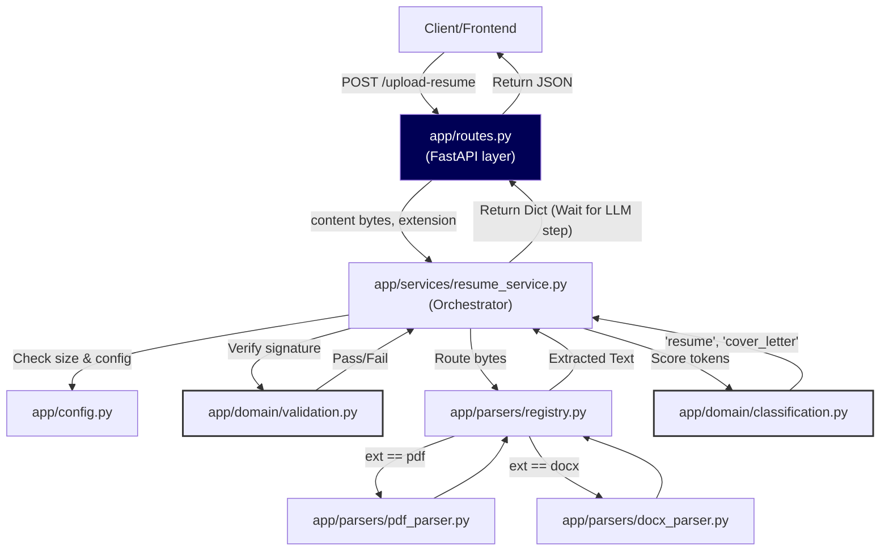

# System Architecture

The Resume Agent utilizes a Domain-Driven Design (DDD) structure to maintain strict boundaries between its input layers, processing engines, and business logic. This ensures traceabilty and enables safe iteration with the local LLM.

## Module Breakdown (`app/`)

### 1. `domain/`
Hosts pure business logic, custom exceptions, and core data models independent of external libraries or frameworks (like FastAPI). 
- `exceptions.py`: Application-specific errors ensuring our API routing can return clean HTTP status codes mapped to exact logic failures.
- `validation.py`: File validation via magic-bytes (preventing disguised executables from crashing the parsers).
- `classification.py`: Pure heuristic algorithms (e.g., scoring text tokens) to reject letters of recommendation or cover letters from being processed as resumes.

### 2. `parsers/`
Handles text extraction decoupling.
- `pdf_parser.py` & `docx_parser.py`: Wrap respective third-party libraries (`pdfplumber`, `python-docx`).
- `registry.py`: A dynamic switchboard used by the services layer to fetch the right extractor cleanly, reducing if/else spaghetti.

### 3. `services/`
The orchestrator.
- `resume_service.py`: Contains `process_resume_upload`, chaining validation, parser registry, and classification sequentially. 

### 4. `routes.py`
The FastAPI transport layer. Merely fields the request, offloads it to `services/`, and catches any domain exceptions to format standard REST responses.

---

## Data Flow Diagram

---

## Future Extensibility: The 8-Stage Pipeline

This directory structure is purposefully designed to scale gracefully into the finalized 8-stage pipeline:
1. **Upload** (Done)
2. **Parse** (Done)
3. **Normalize** (Pending `services/normalization.py`)
4. **JD Resolution** (Pending `services/jd_service.py`)
5. **Grade** (Pending `services/llm_service.py` to bridge local Qwen 3)
6. **Recommend** (Pending Domain traceability tagging logic)
7. **Human Review** (Client side)
8. **Regenerate** (Pending `services/pdf_generator.py`)
